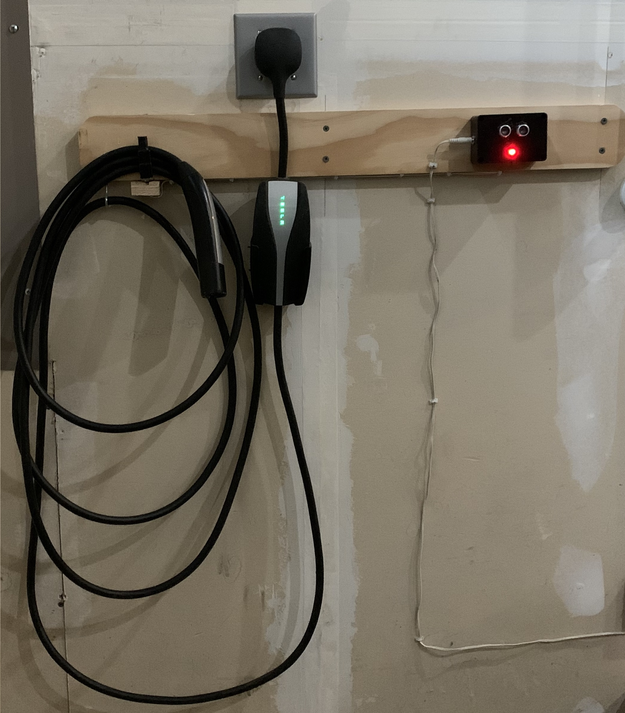

# Tesla-Battery-Charge-Reminder
Arduino Nano or ATTiny85 sounds a buzzer if the Tesla is in the garage but not plugged in.

This project is described in the Arduino Project Hub site:

https://create.arduino.cc/projecthub/thedalles77/tesla-battery-charge-reminder-347bca?ref=search&ref_id=tesla%20battery%20charge%20reminder&offset=0

Read the PDF "Tesla Charge Reminder" for more details.

